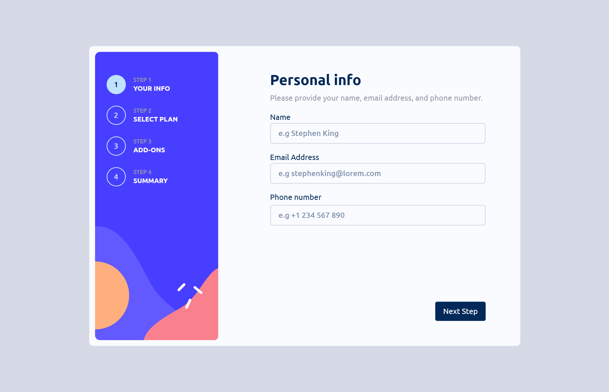

# Frontend Mentor - Multi-step form solution

This is a solution to the [Multi-step form challenge on Frontend Mentor](https://www.frontendmentor.io/challenges/multistep-form-YVAnSdqQBJ). 

## Table of contents

- [Overview](#overview)
  - [The challenge](#the-challenge)
  - [Screenshot](#screenshot)
  - [Links](#links)
- [My process](#my-process)
  - [Built with](#built-with)
  - [What I learned](#what-i-learned)
- [Author](#author)

## Overview

### The challenge

Users should be able to:

- Complete each step of the sequence
- Go back to a previous step to update their selections
- See a summary of their selections on the final step and confirm their order
- View the optimal layout for the interface depending on their device's screen size
- See hover and focus states for all interactive elements on the page
- Receive form validation messages if:
  - A field has been missed
  - The email address is not formatted correctly

### Screenshot

### Links

- Solution URL: (https://www.frontendmentor.io/solutions/multistep-form-with-react-and-tailwind-h03oIn2ibO)
- Live Site URL: (https://multistep-form-seven-gamma.vercel.app/)

## My process

### Built with

- [React](https://reactjs.org/)
- [Typescript](https://typescriptlang.org/)
- [Tailwind](https://tailwindcss.com/)
- [Zod](https://zod.dev/)

### What I learned

I learned to work with multistep forms and to validate them separatly. I also learned how to use libraries for the validation instead of using regex

## Author

- Website - [Andi Gashi](https://portofolio-henna-beta.vercel.app)
- Frontend Mentor - [@Andigashi1](https://www.frontendmentor.io/profile/andigashi1)

